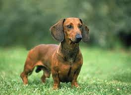

# Basic Information About Me
::: incremental

- I was born in Pomona California and lived there for several years, before moving to Casper, Wyoming

- I grew up in Casper for most of my life, but did move to Colorado for a few years before moving back to Casper

- I lived in Boulder, Colorado for one semester of college, and then moved to Laramie, Wyoming

- I now currently live in Lincoln, Nebraska
:::

# Other Information
::: incremental

- I'm 23 years old and my birthday is November 3rd

- I love watching movies and tracking box office data! It's also fun to rate movie!

- I am a sports aficionado! I love watching football, basketball, and baseball. I've also branched into
watching soccer and hockey

- I also enjoy spending time with my fiance!

:::

# Career Information
::: incremental

- I completed my undergrad at Wyoming, receiving a BS in Mathematics and a BS in Statistics
- I'm in my first year of the graduate program in Statistics at UNL
- I anticipate getting a Master's Degree, and probably the PhD
- My anticipated graduation for the Master's is May 2023

- I'm not exactly sure what I want to do, but I enjoy Time Series, Sports Analytics, and Bayesian Statistics
- I'd like to apply statistics to Sports, Astronomy, and Transportation

:::

# Picture of my Favorite Animal
<section>
  
</section>


# A Picture of a Pangolin {data-background-image="pangolinpicture.jpg"}

# My Favorite Plot
```{r}
#| eval: true
#| echo: false
#| warning: false
#| output-location: slide
# load in the data set
data(penguins, package = "palmerpenguins")
library(ggplot2)
ggplot(data = penguins, aes(x = bill_length_mm, y = body_mass_g)) + 
  geom_point(aes(shape = species, color = species)) + 
  ggtitle("Penguin Bill Length and Body Mass") + 
  xlab("Bill Length (mm)") + 
  ylab("Body Mass (g)")
```


